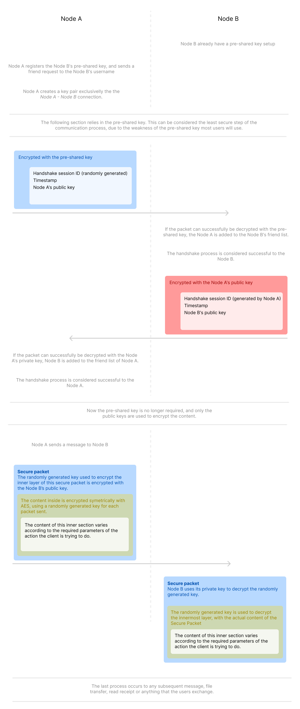
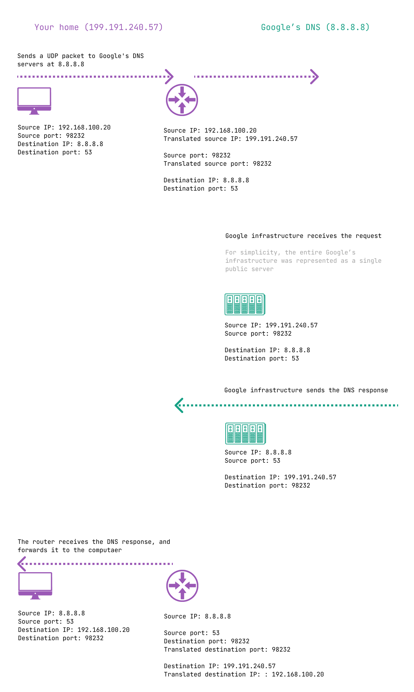
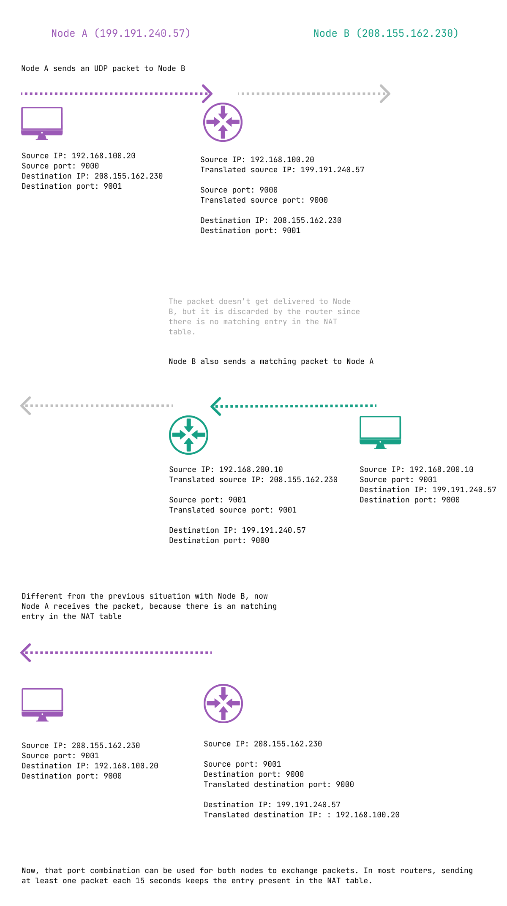

This is a PoC project of a distributed end-to-end encrypted messaging app. Since this app was used to learn more about encryption, messaging, and connection, I tried my best to document the architecture and issues I had while developing it. This system is not meant to be used in production without a broad security research, and software improvement, but it's a fun project to play with and extend.


# List of functionalities and characteristics of the app

- Securely handshaking (adding) new contacts
- Sending messages between contacts
- Receiving deliver and read confirmations
- Persisting the messages and contacts
- Exchanging messages between users globally (via WAN) or locally connected (via LAN) using a relay server
- Message delivery and seen notifications

# How to run in your machine

## Dependencies

First, you need Python 3.6 installed, and pip (Pthon's package manager). Then, install the dependencies:

```bash
pip3 install -r requirements.txt
```

## Running the relay server

For two nodes to communicate, there must be a known relay server running, and the relay server needs to have the port TODO: port number open.

To run the server, you must install the dependencies, and run the Python script located in TODO: relative path for the Python script

## Running the nodes

To run the nodes, after installing the dependencies, run the Python script located in TODO: relative path for the Python script. You should run the same script in two terminals to represent two nodes willing to communicate with eachother.

## Starting the app

When starting the nodes, some information will be requested, such as the username, pre-shared key, and the IP address of the relay server. Following, there is an example of the information requested (values in brackets are the default values):

```bash
$ python3 main.py
Enter your username: nodeA
Enter your pre-shared key [123456]:
Enter the relay server IP address: 192.168.30.1
Enter the relay server port [5000]:
Setup finished. The app is ready.
```

The same process can be applied to Node B, just changing the username, and keeping the same server and pre-shared key.

## Adding a contact, and sending messages

After starting the app and informing the configuration values, it should be possible to add a contact, and to send messages. Following, messages from Node A will be prefixed with "[A]", and from Node B with "[B]"

```bash
[A] friend nodeB
[B] Friend request accepted from nodeA
[A] Successfully added nodeB

[A] message nodeB Hello, world!

[B] nodeA: Hello, world!

[A] nodeA: Message delivered
[A] nodeA: Message read
```

That's it! It's a simple application sending secure encrypted messages from one node to the other.

## What distributed and end-to-end enctypted means in the context of the project

Most messaging apps requires the user to be registered to some central authority. This way, even tho the messages are exchanged between contacts (and are virtually only readable by the contacts itself), if the central authority goes down, is blocked by the ISP or bans your user account, the messaging doesn't work anymore for you. That centralization isn't all bad: imagine you messaging someone without knowing if that person is actually who you want to chat with.

The architecture of this project doesn't rely on the user being registered to some central authority. Rather, the trust between each pair of users is all it's needed to exchange messages. There is no concept of a global user, or globally unique usernames. Each pair of users know and trust each others username and keys. When adding a new contact, a pre-shared key (password exchanged between the two contacts previously) is used to stablish only that first "handshake". After that, the two users trust each others, and that initial pre-shared key is never used again.

This way we don't need a central authority to manage user authentication, but so far we can only communicate with users that have a public IP with an application listening on an open port, which won't be conveninent, and not event possible for most people. In LAN networks, it's easier for this to work if we can manage the OS's firewall, and the network infrastructure allows communication between the hosts, but the communication would be limited to people in the same network.

To fix this, a way to communicate between multiple clients in different globally distributed networks is necessary. For this, we can use a relay server (actually, multiple relay servers with routing capacity would be better), which basically forward messages from usernames to usernames. One can argue that if there is a central server to relay messages, the system is not distributed, but the relay server serves only to forward the messages. If implemented correctly, the server would never filter or block users from connecting. Moreover, the server doesn't need to be controlled by a central authority, and it would be better for each client to have dozens of "root relay servers" from different authorities, and select the most efficient for connecting to the destination username. If necessary, the user can host it's own server, or if using in an organization, there can be one secure relay server exclusive for communication between users in that same organization.

Two drawbacks I would like mentioning about that distributed relaying architecture is that anyone can say they are you (by using your username) and receiving messages directed to you, and there is a need to have a prior commuication with the contact you want to add, to exchange the pre-shared key. Virtually, there is no problem relaying a message to unwanted users, since the system uses a strong encryption, but also it isn't ideal. To fix this, the relay server can require the user pair to stablish a handshake between them, fixing the relay issue, but again the server would be allowed to intercept all those requests. As said before, the handshare requires that a pre-shared key is known between both users. Even the pre-shared key being used only once to stablish the encrypted handshake, if the packet is intercepted and the key is known by the interceptor, the whole secure communication process is compromised. For this, it's necessary that the users have a prior communication channel. They can physically exchange that information, use other encrypted and secure playform or send parts of the pre-shared key in multiple different communication platforms, or build a trust network between trust contacts, or require a personal information that only the person knows, to include in the key.

# The handshake in-depth

The handshake process is the first and most sensible part of starting a connection with other user. Following, there is a diagram, followed by a detailed explanation of each phase and decision.



## Overview

TODO: Describe the handshake

## Should we use a pre-shared, asymmetric or symmetric encryption?

Since the core of this project is the encryption, I tested each method to decide which one would be the best for the project's purpose. Following, there are a detailed motivation for the reason we chose one, or other encryption method.

### Pre-shared key

The symmetric encryption with a pre-shared key is the easyest to note why it isn't the best option. First, it is the same to both users, so if that key is discovered, the complete process is compromised.
Second, even if generated randomly, being long and created by a trusted password generator, it must be known by both nodes before the handshake, which creates a problem: to securelly and privatelly exchange this key via another communication platform.

Even the pre-shared key not being the best method to encrypt the content, it is conveninent to start the handshake with a new node. It's easier to share a pre-shared key with another user then it is to generate a key pair, and send the long public key to the other user. Also, it's easier to share parts of a pre-shared key in different communication medias the it is to send parts of a public key. Third, if there is a known secret between two nodes, you can derivate this secret.

To exemplify, following there are an example of how a pre-shared key can be securely shared from Node A to Node B:

1. User in Node A sends to User in Node B via a social media: The first part of the key is the text: mf8k49j7d348
2. User in Node A sends to User in Node B via email: The second part of the key is the text 30m8dh30, and at the end, put the text we both know, that we talked about in the call we did an hour ago.

### Asymmetric encryption

Another method is the asymmetric key encryption, which is ideal in that case. In fact, the actual encryption depends directly on the asymmetric key encryption.

With the asymmetric key encryption, we can use two private and public key pair, in which each node will have only the public key of the other node. The key used in this process is long and secure, and if one key is discovered, only half of the connection will be compromised.

As mentioned before, it's not convenient to share the public and private key with the nodes. For this, a pre-shared key is used. Actually, tis pre-shared key is used as little as possible, only to send the first public key. After that, this pre-shared key is not used anymore. This reduces the less secure window to only seconds, in which a user can intercept and bruteforce the encryption.

Moreover, we use a public/private key pair to each directional "link" between two nodes. This means that there is one key pair when Node A wants to communicate with Node B, another pair when Node B wants to communicate with Node A, and a third when Node A wants to communicate with Node C.

If ideal, this process could be used to encrypt all the connection, but there is one big limitation of the RSA asymmetric encryption used in this app: The size of the content to be encrypted can't be large than the public key length, which is relativelly small.

### Asymmetric encryption limitation, and the asymmetric/symmetric mix

One limitation of the RSA asymmetric key encryption is that [is can only be used to encrypted content that is less then a little less then the key length used](https://security.stackexchange.com/questions/33434/rsa-maximum-bytes-to-encrypt-comparison-to-aes-in-terms-of-security). Let's take the use of a key of length 2048 bits for example. In that case, the content of the content to be encrypted can't be greather than 245 bytes, which is 245 characters in ASCII. This limit is too low to be practical, so we need to use a better strategy that allows larger content to be encrypted.

TODO: Detail why the size limit

The solution is to use symmetric encryption, which the limit of the length of the content is virtually unlimited (In the case of the protocol AES used in this application). By using symmetric encryption, we have the same problem mentioned in the pre-shared key section: if the key is intercepted and discovered, the entire encryption is compromised.

The solution we used, which is commonly used in general encryption is to use both the asymmetric and symmetric encryption.

In details, the actual content that needs to be encrypted is first encrypted with a symmetric key randomly generated at the time of the encryption. This symmetric key is not longer then the maximum size allowed by the asymmetric key size. Then, this symmetric key is encrypted using the asymmetric key. After that, both the inner content encrypted with the symmetric key, and the symmetric key encrypted with the asymmetric key are sent to the destionation. The node receiving this content can do the reverse to decrypt the message.

This is the method of encryption actually used in this application. Using this, the content length is virtually unlimited, while the process is still secure.

# Architecture for interconnecting users

As mentioned before, this application was architectured to not depend the most on the interconnection method between users. Having a secure encryption, it's not a big security risk if the messages are intercepted.

It must be noted that the problem we're discussing in this topic is solely the delivery of bytes from one node to other node. Any more that that is responsability of the application, and not exclusivelly of the interconnection.

Also, it was a prerequisite for this project to work with NATed home networks, enterprise, and mobile carries networks, not depending on firewall configuration.

In fact, from the start of the project, the connection between clients were considered not important, because it could be implemented in different ways without affecting significantly the working and security of the messaging. With the handshake, encryption and synchronization architecture, the connection implementation could be P2P, TCP, UDP, Relay or other methods.

Initially, I listed some methods to test for exchanging packets Some peer-to-peer connection (most common is UDP hole-punching), open ports in the router, UDP broadcast, and a "central" relay server. Following, i'll detail each available method:

## Peer-to-peer connection

Some kind of peer-to-peer connection would be ideal for the purpose of this application, but that isn't practical for most home and enterprise routers and configurations. For home networks, most routers and ISP blocks peer-to-peer connectinos, and in enterprise networks, it's very common for network engineers to block it also.

### UDP hole-punching

A more precise analysis could be made to detect the probability of routers to allow some kind of peer-to-peer connection, but I tested only once from two home networks between two different places, and it didn't work all the times. Due to the failure in this simple case, I decided to not rely on it, but feel free to contribute to this post and evaluate if you router supports some kind of peer-to-peer connection.

One method of peer-to-peer connection, which to the router doesn't appear to be a peer-to-peer connection is the UDP hole-punching. This method consists of exploring the origin and destination port mapping of firewall/router routing tables, using the UDP protocol. When creating the application, I spent a long time trying the UDP hole punching, and following, I document the working of this method. If you want a more detailed explanation of UDP hole-punching, there is two awesome references in the topic:

- [UDP Hole Punching in TomP2P for NAT Traversal](https://files.ifi.uzh.ch/CSG/staff/bocek/extern/theses/BA-Jonas-Wagner.pdf)
- [Peer-to-Peer Communication Across Network Address Translators](https://bford.info/pub/net/p2pnat/)

#### How does the UDP hole-puncing works

##### Network Address Translation table

Due to the limited amount of IPv4 addresses (around 4 billions, whish is way less than the devices connected to the internet), most IPv4 routers (the one used at your home and at your office included) uses Network Address Translation (NAT) to allow multiple clients in a local network to use one single public IP.

This mappnig works as following:

1. Your computer with the IP 192.168.100.20 makes a DNS UDP request to Google's DNS server with the IP 8.8.8.8.
2. Being DNS, the destination port is 53, and the source port is chosen (most often randomly) by your operating system.
3. Before forwarding the packet to ther internet, your router changes the source address from 192.168.100.20 to the public IP of your home or office, for example 199.191.240.57.
4. To know how to send the response back to your computer, the router saves the information necessary to map the response to your computer. An example of that table is shown below:

| Local IPV4     | Local source port | Translated IPV4 | Translated source port | Remote IPv4 | Remote port |
| -------------- | ----------------- | --------------- | ---------------------- | ----------- | ----------- |
| 192.168.100.20 | 98232             | 199.191.240.57  | 98232                  | 8.8.8.8     | 53          |

5. Now the router knows that when receiving a packet from Google's IP 8.8.8.8 with the source port 53, and the destination port 98232, it should forward the packet to your computer.



That's the basic working of NAT. If we were not using NAT in this case, there could be two cenarios:

1. Your computer would be connected in bridge mode with your router, having the IP 199.191.240.57 and receiving all requests from any origin. That's actually possible to implement. The only advantage is that there could be only your computer connected to your network.

2. Your computer would send the packet to Google, but the response would be delivered to your router, and it wouldn't know what to do with the packet (it wouldn't know if it should forward or to who forward to, or if it should accept to itself), and probably it would be discarded.

In most enterprise routers, it's possible to view the actual connection and NAT table, and identify the translations.

##### Using the NAT table for other purposes

NAT introduces a problem, whose side effect is a great security feature: only hosts with who you started a connection could respond to your computer. In other words, no server can by itself send packets to your computer. Let's return to our NAT table created in the previous section.

| Local IPV4     | Local source port | Translated IPV4 | Translated source port | Remote IPv4 | Remote port |
| -------------- | ----------------- | --------------- | ---------------------- | ----------- | ----------- |
| 192.168.100.20 | 98232             | 199.191.240.57  | 98232                  | 8.8.8.8     | 53          |

Now, imagine that your friend's IP 3.201.165.30 wants to connect to your computer 192.168.100.20 at port 9000. First, your computer has a private IP, and that private IP can't be used as a destination IP to a remote networn. For that, your friend must use your public IP 199.191.240.57. Now, when your friend sends a packet to your public IP with the destination port 9000, the router will look at the NAT table for the translated source port 9000, and will not find any registry. Due to the registry not being found, it will reject the packet. That behaviour (default to most routers) makes harder for any user to communicate with any other user on the internet.

This is a good feature, because an old operating system publicly accessible to the internet is incredibly dangerous. Using NAT, no unwanted traffic from the internet will reach the old operating system.



Note: Most routers that have NAT also allows port mapping configuration, in which you tell the router to always redirect a port to a specific internal IP, but that won't be considered because it's impractical to configure the router of each place you want to use this software, or in routers you don't control. Also, the port mapping is not a feature for users behind a [CGNAT](https://en.wikipedia.org/wiki/Carrier-grade_NAT), nor for users using mobile phone networks.

To achieve peer-to-peer communication, we can take advantage of that port mapping and force it to accept connection from other host. For example, you can coordinate beforehand with the other host (Host B) that you're gonna use the destination port 9000, and the Host A the destination port 9001. Now, your computer will make a request, which will create a registry in the NAT table of your router (actually, it will also create registries in the CGNAT or mobile network router). After that, your router's table will look like the following:

| Local IPV4     | Local source port | Translated IPV4 | Translated source port | Remote IPv4 | Remote port |
| -------------- | ----------------- | --------------- | ---------------------- | ----------- | ----------- |
| 192.168.100.20 | 9000              | 199.191.240.57  | 90001                  | 8.8.8.8     | 9001        |

After that, Host B won't receive this packet, but at least your router will have that mapping alive for about 30 seconds. Knowing that table, it's clear that if the host 199.191.240.57 sends a packet to your public IP with the destination port 90001, and the source port 9000, that packet will be redirected to your computer with the IP 192.168.100.20. In fact, that will actually work in most cases, and if you do this in both sides, you have a two-way peer-to-peer communication using UDP hole-punching.

##### Rendezvous server

For the UDP hole-punching to work, it's necessary to both the clients to know which destination ports they will use. It's not practical to guess or use all possible ports. For that, a so called Rendezvous server is necessary. The server serves only the purpose of choosing two random ports and informing them to the clients for them to use as destination ports for the hole-punching. During the labs, we implemented a Rendezvous server, and the sources can be found in the git history.

##### Limitations

Previoulsy I mentioned that this will actually work in most cases because that will only work for routers with specific configuration, one being the Symmetric NAT, which is the one examplified previously. It's called symmetric because the source port your computer specified is the same one as the source port forwarded by your router to the internet (called the Translated source port).

| Local IPV4     | Local source port | Translated IPV4 | Translated source port | Remote IPv4 | Remote port |
| -------------- | ----------------- | --------------- | ---------------------- | ----------- | ----------- |
| 192.168.100.20 | 9000              | 199.191.240.57  | 90001                  | 8.8.8.8     | 9001        |

Knowing the translated source port is essetial for UDP hole-punching. In a non-symmetric NAT, the router will use a different translated source port as the one your computer specified, and that will make the peer-to-peer connection not work.

| Local IPV4     | Local source port | Translated IPV4 | Translated source port | Remote IPv4 | Remote port |
| -------------- | ----------------- | --------------- | ---------------------- | ----------- | ----------- |
| 192.168.100.20 | 9000              | 199.191.240.57  | 97238                  | 8.8.8.8     | 9001        |

That's one case in which your router won't allow the connection to work, but if the router has a demilitarized zone (when conducting the lab, my router had one, and that made the connection to not occur), even with symmetric NAT, the connection won't always work. That's because with the DMZ, any packet not mathing the NAT table is routed to the demilitarized zone IP, and the router will save that as a new mapping. Any new connection from your computer to the destination will force the router to choose a new port, since that port is already present in the NAT table. Also, if the timeout of that NAT table is too short, or it has some other specific configuration, the method won't work.

Concluding, we can see that UDP hole-punching is a method that will work in some combination of origin and destination router configurations, but it's not good to rely on a connection that works only sometimes. Because of that, we discarded UDP hole-punching for this project.

Note: You can easily make a UDP hole-punching lab with [Netcat](https://en.wikipedia.org/wiki/Netcat), and that's good to diagnose and understand the working of this procedure.

Note 2: The system can be improved by having a hybrid interconnection strategy, using UDP hole-punching when possible, and relay as an alternative method. Probably, that will make the system more resilient and secure.

#### Issue with my home router

Conducting some tests, I noticed that the UDP hole punching is not effective with the router I have.

If I (A) start listening and send a packet to B, it works.

If B starts listening and send a packet to me (A), when I open the socket to listen on the port, the NAT translates the source address, making the connection not work.

It looks like my router creates a NAT registry for the packet, even if it's not expecting a new connection. Actually, as I'm writing this I remembered I configured a DMZ with an IP address other the the client I was testing. Probably that caused the issue, making the router accept any UDP or TCP connection and forward it to the DMZ IP. Later I'll do some testing and confirm this. Knowing that, probably this software won't work with routers that have DMZ enabled.

Other things worth trying:

- Send both the packets at the same time (less than 1 second deviation)

Either way, the relay server is the most compatible solution, the bad thing is that it adds a server resource cost.

UPDATE: I just validated, and it was the DMZ that was causing the issue. To test it, I used my LTE connection, which uses asymmetric NAT. In that case, it worked when A started, and when B started, but always only the A (The router at my house with symmetric NAT) received message from the B (LTE with CG-NAT and asymmetric NAT). Probably, there's a way to make it work with asymmetric NAT.

People say that the client's source port seen by the rendezvous server can be used as the destination port to requests made from another client. Probably NAT entries considers the source IP address when translating, and doesn't allow a different source IP address to use the same port to respond to the same client.

TODO: Include a diagram of the port translation

### Limitations

Close to what happens with the Onion network, for example, is that your ISP and the relay servers can intercept the messages, but cannot read the content. This is something to keep in mind, since the traffc pattern and time can be analyzed, and can help on discovering and locating people.

### How does the existing apps handle exchanging messages between devices?

Aparently Skype uses or used P2P connections to transmit call data and files, specifically UDP hole-punching.

Acording to the discussion in the thread [Is whatsapp peer to peer like skype? If yes, How am i able to send offline message to other people? If not, won't it be better to make it peer to peer since it will remove server connection overhead?](https://www.quora.com/Is-whatsapp-peer-to-peer-like-skype-If-yes-How-am-i-able-to-send-offline-message-to-other-people-If-not-wont-it-be-better-to-make-it-peer-to-peer-since-it-will-remove-server-connection-overhead) on Quora, WhatsApp appears to use a version of XMPP, which forwards the messages to central servers, so they can queue, store, and forward the messages to other clients. Aparently, that also happens for file transfer.

### The solution: Relay servers

The most compatible solution found for the case of this application was the use of relay servers, which are central applications that forward messages between nodes.

Currently, the relay server present in this project maintains a list of recent connected nodes. If in a timeout, a host doesn't send a keep-alive request, the node is considered offline and is removed from the list. For a host to register, it's only needed the username. When a node sends a packet to other host, the relay server forwards the message to all active UDP connections matching the username. You can see that there is a security concearn that people can fake their usernames and listen to the packets, in fact that could happen, but keep in mind that the content is completly encrypted.

Since the server is responsible only to relay messages from one client to the other, all users can use the same server, or there can be hundreds or thousands of servers. There can be routing between the servers, and the client could connect to multiple "top level" servers, not relying in only one server or group. Further, one can implement it's own local or remote server, to handle communication in the same organization, or between peple working remotely.

This project has the most basic relay server, that keeps the last active clients, and relay messages based on username. Since it's the only public part, this module in which there is the most possibility for improvements. It needs better strategies of security, resilience, filterin, queueing and routing.

#### When using relay severs, the connection can still be distributed

Using a central relay server doesn't mean that a central authority controls the traffic and filters it. If using a central server, there would be a security improvement, because each user could be registered by a key, and we could have unique usernames, but that introduces a problem also: everything depends on the central server.

To fix this, the relay server just forward the messages, and doesn't authenticate users. Currenty, the application supports only one relay server, but if implemented, the application could always use dozens of servers. In that case, if a authority goes down, or starts blocking requests from one user, it could be replaced by any other relay server. Of course, that would require two nodes to have at least one working relay server in common, or to be a routing, discovery and trust chain between the servers. It could even be possible for an individual or an organization to host its own relay server. By default, the application could come with dozens of relay servers, and allow the user to use custom ones. Again, as long as there is one path for packets to flow between two nodes, the secure communication is possible.

In the section Extending this project, there is ideas on how this important feature of the relay server could be improved.

### Alternative names for processes mentioned before:

TODO: Explain more

- Relay and NAT TURN and NAT STUN.
- Explain different ports in nat, the router reusing ports, etc.

# Extending this project

This project is open source, and contribution is much appreciated both in the code itself, and the documentation and examples. This project is not activelly maintained, and it was intended more as a PoC and to document this process, than to be used in production, so keep in mind that if you want to use this project, a more in-depth analysis of the algorithms and the encryption must be done.

At the end, I decided to document in details this project, because even being simple, it served its purpose really well: to teach me things I didn't know about encryption, synchronization and interconnecting users.

## Asymmetric encryption method and library

The part I would most study and change would be the asymmetric encryption method and library. Probably, the RSA encryption algorithm can be replaces with a stronger one, but most important, the library used for the RSA encryption is not well-known. One alternative to it would probably be the [PyCryptodome](https://pycryptodome.readthedocs.io/en/latest/src/public_key/rsa.html), which has a better reputation.

## Group chat

If your willing to extend this project, a group chat is one relevant topic, but it's not simple, it's not as simple as relaying the message to all users in a grou, rather, i think it's necessary to keep a connection between each pair of users in a group.

## Message sygning and synchronizing

Since we already have asymmetric encryption, the key pairs can be used to sign each send message, so we can confirm that a message was sent by a specific user. Having message signing, a good feature would be the synchronization of messages, in a way that each user have all the sent and received messages. If a friend of that user loses it's sent or received messages, it can request a synchronization from the messages stored in other user's system.

## Offline messages and queueing in the relay server

Currently, the relay server doesn't have a queue, neither it does save messages if the destination node is offline. This is also a good feature to have.

## File transfer

This is a big feature the project could have, but the transfer wouldn't be just a send and receive. Rather, the file must be sent in parts, and there should be a whole process to organize, send, receive and confirm the sending of a file.

## Confirm when accepting a friend request

Currently, when a user receives a friend request from one which have the same pre-shared key, the request is automatically accepted, and the user is instantly added to the friend list. It's a great update to prompt the receiving user to accept or deny the request. Also, there could be a "allow friend requests" state, and the pre-shared could be tied to a specific username.

## Username uniqueness

When using the "distributed" architectured of this project, we cannot rely on the uniqueness of the usernames. The relay server is prepared to work with duplicate usernames, but the nodes are not tested to that case.

# TODO: SPEED LIMITATION / THE NEW CHALLANGE: "LARGE" CONTENT, AND "FAST" TRANSFER SPEEDS

Practical UDP limitations: MTU of 1500, and practical maximum safe UDP payload size

Sending pieces of files. MTU, max UDP and TCP size

https://skerritt.blog/bit-torrent/

Slow start in TCP: https://www.isi.edu/nsnam/DIRECTED_RESEARCH/DR_HYUNAH/D-Research/slow-start-tcp.html?ref=skerritt.blog
